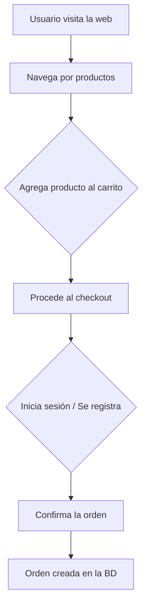

# Informe del Proyecto Semestral: E-Commerce "Mokip" con Base de Datos NoSQL

## Introducción

### Descripción del Proyecto

"Mokip" es una plataforma de comercio electrónico diseñada para ofrecer una experiencia de compra moderna, fluida y escalable. El objetivo principal del proyecto es desarrollar una aplicación web completa que permita a los usuarios registrarse, iniciar sesión, explorar un catálogo de productos, gestionar su carrito de compras y realizar pedidos. A su vez, proporciona funcionalidades administrativas para la gestión de productos, usuarios y órdenes.

Para cumplir con este objetivo, se ha optado por una arquitectura de backend que utiliza **Xano**. Esta plataforma expone los datos a través de una API RESTful, permitiendo un manejo de la información similar al de una base de datos NoSQL. Esta elección es estratégica para facilitar un desarrollo ágil, manejar estructuras de datos flexibles (como las de los productos) y asegurar la escalabilidad del sistema a futuro.

### Alcance

El alcance del proyecto abarca las siguientes funcionalidades clave, todas gestionadas a través de la interacción con la base de datos:

*   **Autenticación y Gestión de Usuarios:** Registro de nuevos usuarios, inicio de sesión y gestión de perfiles.
*   **Gestión de Productos (CRUD):** Los administradores pueden crear, leer, actualizar y eliminar productos del catálogo. Los productos pueden tener atributos variados.
*   **Catálogo de Productos:** Los usuarios pueden ver la lista de productos, filtrarlos y ver los detalles de un producto específico.
*   **Gestión de Carrito de Compras:** Los usuarios pueden agregar productos a su carrito, actualizar las cantidades y eliminar artículos.
*   **Gestión de Órdenes:** Creación y seguimiento de órdenes de compra.

La base de datos NoSQL (a través de Xano) es el núcleo central que almacena y gestiona toda la información relacionada con usuarios, productos, carritos y órdenes, permitiendo una interacción dinámica y en tiempo real con la aplicación frontend.

### Tecnologías Utilizadas

*   **Backend y Base de Datos:** **Xano**. Aunque Xano utiliza una base de datos PostgreSQL subyacente, la expone a través de una API RESTful que opera con objetos JSON. Esto nos permite modelar y manipular los datos como si estuviéramos trabajando con una base de datos NoSQL orientada a documentos, beneficiándonos de su flexibilidad.
*   **Frontend:** JavaScript (posiblemente con un framework como React, Vue o Angular, que consume la API).
*   **Entorno de Ejecución:** Node.js.
*   **Comunicación:** API RESTful para la comunicación entre el frontend y el backend de Xano.

---

## Diferencias entre Bases de Datos Relacionales y No Relacionales

### Bases de Datos Relacionales (SQL)

*   **Definición y Características:** Almacenan datos en tablas estructuradas compuestas por filas y columnas. Utilizan un esquema estricto y predefinido (`schema-on-write`), donde la estructura de los datos debe ser definida antes de insertarlos. Se basan en el lenguaje SQL (Structured Query Language) y garantizan las propiedades **ACID** (Atomicidad, Consistencia, Aislamiento, Durabilidad), lo que las hace muy fiables para operaciones transaccionales.
*   **Ventajas:**
    *   **Consistencia de datos:** Las propiedades ACID y los esquemas estrictos garantizan la integridad y fiabilidad.
    *   **Lenguaje estandarizado:** SQL es un estándar maduro y ampliamente conocido.
    *   **Ideal para datos estructurados:** Excelente para aplicaciones donde las relaciones entre datos son complejas pero bien definidas.
*   **Desventajas:**
    *   **Rigidez:** La necesidad de un esquema predefinido dificulta la adaptación a cambios.
    *   **Escalabilidad:** Generalmente escalan verticalmente (aumentando la potencia del servidor), lo cual puede ser costoso.

### Bases de Datos No Relacionales (NoSQL)

*   **Definición y Características:** Abarcan varios modelos de datos (documentos, clave-valor, columna ancha, grafos). No requieren un esquema fijo (`schema-on-read`), lo que permite almacenar datos con estructuras variadas y dinámicas. Priorizan la disponibilidad y la escalabilidad sobre la consistencia estricta, siguiendo a menudo el modelo **BASE** (Basically Available, Soft state, Eventually consistent).
*   **Ventajas:**
    *   **Flexibilidad:** Permiten cambios rápidos en el modelo de datos sin detener la aplicación.
    *   **Escalabilidad horizontal:** Diseñadas para escalar distribuyendo la carga en múltiples servidores.
    *   **Alto rendimiento:** Optimizadas para grandes volúmenes de datos y operaciones de lectura/escritura rápidas.
*   **Desventajas:**
    *   **Consistencia eventual:** Los datos pueden no ser consistentes en todos los nodos de inmediato.
    *   **Menos estandarización:** Las consultas y la gestión varían mucho entre diferentes bases de datos NoSQL.

### ¿Cuándo usar una u otra?

*   **Relacional es preferible para:**
    *   Sistemas transaccionales donde la consistencia es crítica (banca, finanzas, ERPs).
    *   Aplicaciones con datos altamente estructurados y relaciones complejas bien definidas.
*   **No Relacional es preferible para:**
    *   Aplicaciones con grandes volúmenes de datos no estructurados o semi-estructurados (Big Data, IoT).
    *   Proyectos que requieren alta disponibilidad y escalabilidad masiva (redes sociales, catálogos de e-commerce).
    *   Desarrollos ágiles donde los requisitos de datos evolucionan constantemente.

### Uso en el Proyecto "Mokip"

En "Mokip", se utilizó un enfoque NoSQL a través de Xano. Esta decisión fue ideal para nuestro caso de uso de e-commerce por las siguientes razones:

1.  **Esquema de Producto Flexible:** Los productos en un e-commerce pueden tener atributos muy diferentes. Por ejemplo, un "smartphone" tiene `pantalla` y `batería`, mientras que una "camiseta" tiene `talla` y `color`. Un modelo de documentos (JSON) nos permite almacenar estos productos en la misma colección sin necesidad de columnas vacías o tablas de atributos complejas.
2.  **Desarrollo Rápido:** La flexibilidad del esquema nos permitió iterar rápidamente en el desarrollo del frontend sin depender de migraciones de base de datos complejas cada vez que se necesitaba un nuevo campo.
3.  **Escalabilidad:** A medida que el catálogo de productos y el número de usuarios crezcan, una arquitectura NoSQL está mejor preparada para escalar horizontalmente.

---

## Elaboración de un Modelo de Datos No Relacional

### Tipos de Modelos de Datos NoSQL

*   **Documento:** Almacena datos en documentos, como objetos JSON o BSON. Ideal para datos semi-estructurados. (Ej: MongoDB, CouchDB).
*   **Clave-Valor:** El modelo más simple. Cada ítem es un par de clave y valor. Muy rápido para lecturas y escrituras. (Ej: Redis, DynamoDB).
*   **Columna Ancha:** Almacena datos en tablas con filas y columnas dinámicas. Optimizado para consultas sobre grandes conjuntos de datos. (Ej: Cassandra, HBase).
*   **Grafo:** Utiliza nodos y aristas para representar y almacenar relaciones. Ideal para datos interconectados. (Ej: Neo4j, Amazon Neptune).

### Justificación de la Elección

Para "Mokip", se eligió un **modelo de datos orientado a documentos**, consumido a través de la API de Xano. Esta elección se justifica porque:

*   **Representación Natural:** Los objetos de nuestro dominio (productos, usuarios, órdenes) se mapean de forma natural a documentos JSON. Cada objeto puede ser un documento autocontenido.
*   **Flexibilidad del Catálogo:** Como se mencionó, es el modelo perfecto para manejar la diversidad de atributos en los productos.
*   **Rendimiento de Consultas:** Permite recuperar toda la información de un objeto (ej. un producto con todos sus detalles) en una sola consulta, evitando complejos `JOINs`.

### Estructura del Modelo Implementado

A continuación se describe la estructura de las principales colecciones (o "tablas" en Xano) utilizadas en el proyecto:

*   **`user`**: Almacena la información de los usuarios.
    ```json
    {
      "id": 1,
      "name": "Matias",
      "last_name": "Gonzalez",
      "email": "matias@example.com",
      "password": "hashed_password",
      "status": "active",
      "created_at": "timestamp"
    }
    ```
*   **`product`**: Contiene los detalles de cada producto.
    ```json
    {
      "id": 101,
      "name": "Laptop Pro",
      "description": "Una laptop potente para profesionales.",
      "price": 1200.00,
      "stock": 50,
      "brand": "TechBrand",
      "category": "electronica",
      "images": [
        { "url": "https://xano.io/path/to/image1.jpg" }
      ],
      "created_at": "timestamp"
    }
    ```
*   **`cart`**: Representa el carrito de un usuario.
    ```json
    {
      "id": 201,
      "user_id": 1, // Relación con el usuario
      "created_at": "timestamp"
    }
    ```
*   **`cart_item`**: Un producto dentro de un carrito.
    ```json
    {
      "id": 301,
      "cart_id": 201, // Relación con el carrito
      "product_id": 101, // Relación con el producto
      "quantity": 2
    }
    ```

---

## Manipulación de Bases de Datos con Operaciones CRUD

Las operaciones CRUD (Crear, Leer, Actualizar, Eliminar) se implementaron en el archivo `src/Api/xano.js`, que actúa como una capa de acceso a datos. Cada función en este archivo corresponde a una operación CRUD sobre un recurso específico.

### Ejemplos de Código y Resultados

#### **Create (Crear): `createProduct`**

Esta función envía una petición `POST` a Xano para crear un nuevo producto. Utiliza `FormData` para poder incluir archivos de imagen.

```javascript
// src/Api/xano.js
export async function createProduct(productData) {
  const formData = new FormData();
  formData.append('name', productData.name);
  formData.append('price', productData.price.toString());
  // ... otros campos
  if (productData.images && productData.images.length > 0) {
    formData.append('images', productData.images[0]);
  }

  const response = await fetch(`${BASE_URL}/product`, {
    method: 'POST',
    body: formData
  });
  // ... manejo de respuesta
}
```
*   **Resultado:** Si la operación es exitosa, Xano devuelve un código `200 OK` y el objeto del producto recién creado con su `id` asignado.

#### **Read (Leer): `fetchProducts`**

Recupera una lista de productos. Envía una petición `GET` al endpoint de productos.

```javascript
// src/Api/xano.js
export async function fetchProducts(params = {}) {
  const queryString = new URLSearchParams(params).toString();
  const url = `${BASE_URL}/product${queryString ? `?${queryString}` : ''}`;
  
  const response = await fetch(url);
  if (!response.ok) throw new Error(`Error HTTP ${response.status}`);
  return await response.json();
}
```
*   **Resultado:** Devuelve un array de objetos JSON, donde cada objeto es un producto.

#### **Update (Actualizar): `updateProduct`**

Actualiza un producto existente mediante una petición `PATCH`, enviando solo los campos que han cambiado.

```javascript
// src/Api/xano.js
export async function updateProduct(productId, updates) {
  const response = await fetch(`${BASE_URL}/product/${productId}`, {
    method: 'PATCH',
    headers: { 'Content-Type': 'application/json' },
    body: JSON.stringify(updates)
  });
  // ... manejo de respuesta
}
```
*   **Resultado:** Devuelve el objeto del producto completo con los campos actualizados.

#### **Delete (Eliminar): `deleteProduct`**

Elimina un producto usando su ID a través de una petición `DELETE`.

```javascript
// src/Api/xano.js
export async function deleteProduct(productId) {
  const response = await fetch(`${BASE_URL}/product/${productId}`, {
    method: 'DELETE'
  });
  // ... manejo de respuesta
}
```
*   **Resultado:** Devuelve un código `200 OK` y un mensaje de éxito si la eliminación fue correcta.

### Desafíos Encontrados

El principal desafío fue la gestión de datos binarios (imágenes) junto con datos JSON. La solución fue utilizar `FormData` para las peticiones `POST` (creación de productos), ya que el `Content-Type: multipart/form-data` permite enviar tanto campos de texto como archivos. Para las actualizaciones (`PATCH`), se optó por un enfoque de dos pasos: primero subir la imagen a un endpoint dedicado y luego actualizar el producto con la URL de la nueva imagen, para mantener la simplicidad de las peticiones `PATCH` con `Content-Type: application/json`.

---

## Conclusión

### Resumen

Este informe ha detallado el desarrollo de la plataforma de e-commerce "Mokip", destacando el uso de una arquitectura basada en API con un enfoque NoSQL para la gestión de datos. Se han explicado las diferencias fundamentales entre bases de datos relacionales y no relacionales, justificando la elección de un modelo de documentos por su flexibilidad y escalabilidad. Finalmente, se demostró cómo se implementaron las operaciones CRUD en JavaScript para interactuar con el backend de Xano, superando desafíos como el manejo de archivos.

### Impacto del Proyecto

La solución implementada proporciona una base sólida y moderna para un negocio de e-commerce. La arquitectura desacoplada (frontend y backend independientes) permite que el negocio evolucione tecnológicamente sin necesidad de reconstruir todo el sistema. La flexibilidad del modelo de datos significa que se pueden agregar nuevos tipos de productos o características rápidamente, respondiendo a las demandas del mercado con agilidad.

### Recomendaciones

*   **Optimización de Consultas:** Implementar paginación en todas las consultas que devuelvan listas (ej. `fetchProducts`, `fetchOrders`) para mejorar el rendimiento a medida que los datos crecen.
*   **Caching:** Utilizar una capa de caché (como Redis) para las consultas frecuentes, como la lista de productos o los detalles de productos populares, para reducir la carga en la base de datos y acelerar los tiempos de respuesta.
*   **Búsqueda Avanzada:** Integrar un motor de búsqueda dedicado como Elasticsearch o Algolia para ofrecer funcionalidades de búsqueda de texto completo, filtros facetados y autocompletado, mejorando significativamente la experiencia del usuario.

---

## Anexos

### Código Completo

El código completo de la capa de acceso a datos se encuentra en el archivo:
`src/Api/xano.js`

### Diagramas y Modelos

*(Aquí podrías incluir un diagrama de flujo de la aplicación, un diagrama de la arquitectura o un modelo Entidad-Relación conceptual si lo tienes).*

**Ejemplo de Diagrama de Flujo de Compra:**

